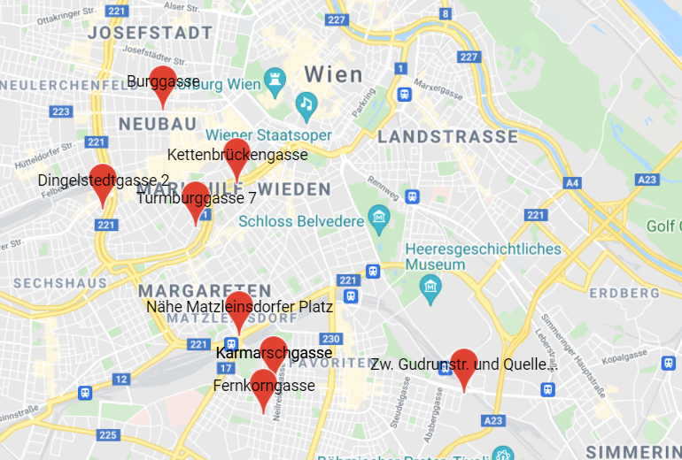

**Find your Dream Living Community by Location**

this projects is a tool to find a matching wg on wg-gesucht.de based on location. it displays all the available addreses with markers and makes them clickable, redirecting you to the respective offer.

However, this tool is not gonna work as intended as wg gesucht doesn't have an official api, making this only workable with cors headers plugins + the pages load differently depending on whether it's directly loaded on wg gesucht or accessed via a 3rd party (e.g some filters, like regions were excluded for me for no apprent reason, thus pagination has to be manual).

